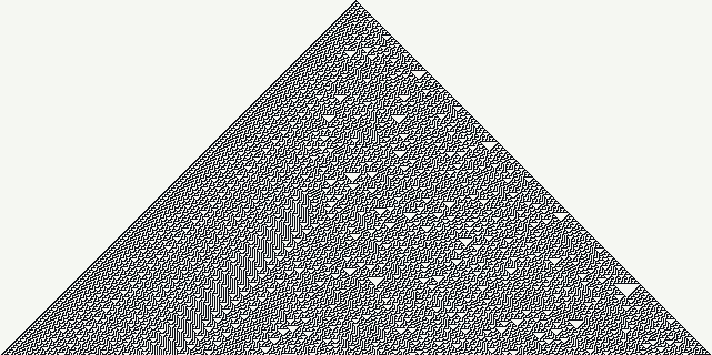
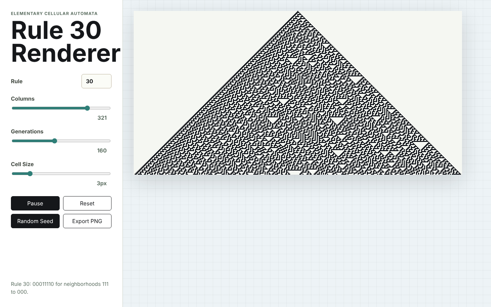
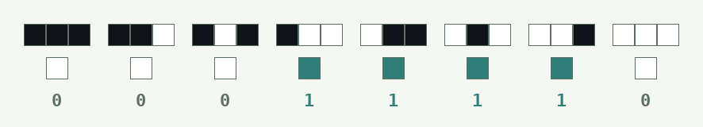
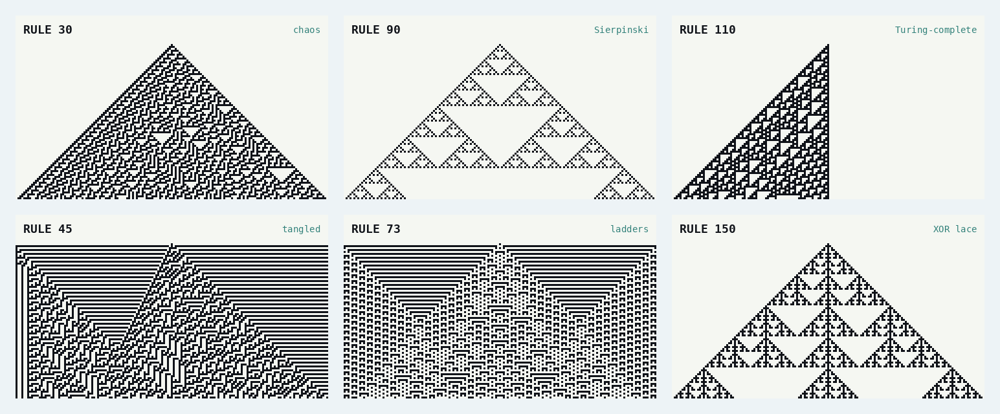

<div align="center">

# Rule 30 Renderer

### one live pixel · eight tiny rules · infinite chaos


*Start with a single black cell. Apply one rule. Get chaos.*

[](#tech-stack)
[](#run-it)
[](#tech-stack)
[](#a-tour-of-the-zoo)

</div>

---

## What is this?

An interactive canvas for **Rule 30**, the cellular automaton that made physicists, cryptographers, and at least one railway-station architect stop and stare.

Here's the whole setup. Take a row of cells. Each cell is black or white. To build the next row, every cell looks at itself and its two neighbours, then follows a lookup table with **eight entries**. That's it. No randomness and no hidden state.

Out of that comes the pattern below. The left edge is rigid and orderly. The right side is a churning mess of triangles that, as far as anyone has proven, never repeats.

<p align="center">
  
</p>

This app lets you watch it grow live, switch to any of the other 255 rules, throw in a random starting row, and export the result as a pixel-perfect PNG.

<p align="center">
  
</p>

---

## Run it

```bash
npm install
npm run dev
```

Open the URL Vite prints (usually `http://127.0.0.1:5173/`) and watch it go.

```bash
npm run build    # type-check + production build into dist/
npm run preview  # serve the production build locally
```

---

## The controls

| Control | What it does |
| --- | --- |
| **Rule** | Any elementary rule from `0` to `255`. Type freely; out-of-range values clamp. |
| **Columns** | Width of the universe. Always odd, so the seed has a true centre cell. |
| **Generations** | How many rows (time steps) to run. |
| **Cell Size** | Pixels per cell, from 2 to 8. |
| **Play / Pause** | Pause freezes the current frame. Play on a finished render replays it from the top. |
| **Reset** | Back to the classic single centred cell. |
| **Random Seed** | Start from noise instead. It stays random when you resize. |
| **Export PNG** | Renders every generation and downloads the canvas. |

> **Tip:** keep `Columns ≥ 2 × Generations + 1`. Rule 30 grows one cell left and one right every step. Once it reaches the edge, it bumps into the always-white border and the pattern gets polluted. The defaults (321 × 160) fit the whole triangle.

If your OS has *reduce motion* switched on, the app skips the animation and shows the finished pattern straight away.

---

## How it works

Every cell in the next row depends on the three cells above it. Three cells, two colours each, gives 2³ = **8 possible neighbourhoods**. A rule just says "black" or "white" for each one:

<p align="center">
  
</p>

Read the outputs as a binary number: `00011110₂ = 30`. **That's where the name comes from.** Every possible 8-bit pattern is a rule, which is why there are exactly 256 of them.

The engine encodes this almost word for word:

```ts
const neighborhood = (left << 2) | (center << 1) | right; // 0..7
const next = (rule >> neighborhood) & 1;                  // pick that bit
```

Rule 30 also has a neat one-line boolean form: **`next = left XOR (center OR right)`**. A single XOR is enough to tip the system from order into chaos.

---

## A tour of the zoo

Same machine, same single-cell seed, different rule number. Type any of these into the **Rule** box:

<p align="center">
  
</p>

- **Rule 30**: chaos from nothing. The headliner.
- **Rule 90**: each cell is the XOR of its neighbours. Out pops a perfect **Sierpiński triangle**, Pascal's triangle mod 2.
- **Rule 110**: grows only to the left, and forms colliding "gliders". Matthew Cook proved it is **Turing-complete**, so in principle this one row of pixels can run any computer program.
- **Rule 45**, **Rule 73**, **Rule 150**: tangles, ladders, and XOR lace.

Also worth trying: **184** (a textbook traffic-jam model; use a random seed), **18**, **54**, **57**, **105**, and **225**.

---

## A short history of very small universes

**1940s: Los Alamos.** John von Neumann wanted to know whether a machine could build a copy of itself. His colleague **Stanisław Ulam** suggested modelling it on a grid of cells with simple local rules. That became the first cellular automaton, a 29-state design that could self-replicate on paper decades before anyone could run it.

**1970: The Game of Life.** John Horton Conway boiled the idea down to a 2D grid with a few birth and death rules. Martin Gardner wrote it up in *Scientific American*, and a generation of programmers lost countless mainframe hours to gliders.

**1983: Wolfram goes one-dimensional.** Stephen Wolfram, then at the Institute for Advanced Study, asked a simpler question: what about one row of cells, nearest neighbours only, two colours? That gives just 256 rules, few enough to try every one. He ran them all and sorted their behaviour into four classes: **uniform, repetitive, chaotic, and complex**. Rule 30 was the stunner. It's fully deterministic and starts from one cell, yet its centre column passes statistical tests for randomness.

**1985: Chaos as a cipher.** Wolfram proposed Rule 30 as a stream cipher (*Cryptography with Cellular Automata*, CRYPTO '85). Its centre column later served as *Mathematica*'s generator for random integers.

**2002: *A New Kind of Science*.** In his 1,200-page book, Wolfram uses Rule 30 as the leading example for a big claim: simple programs, not equations, may be the right language for nature's complexity.

**Nature got there first.** The shell of the venomous cone snail ***Conus textile*** carries a pattern strikingly close to Rule 30. Its pigment cells along the growing lip of the shell switch on and off based on their neighbours, which is a living 1D cellular automaton.

**2017: You can catch a train from it.** **Cambridge North** railway station in the UK opened with its exterior panels perforated in a Rule 30 pattern. The automaton is literally part of the architecture.

**2019: Open problems, with prize money.** Wolfram put up the **Rule 30 Prizes**, $10,000 each, for proving any of these:

1. Does the centre column ever become periodic?
2. Does each colour appear, on average, equally often in the centre column?
3. Does computing the *n*-th centre cell require at least *O(n)* computational effort?

As of this writing, all three remain open. You can watch the patterns these questions are about right here in your browser.

---

## Project structure

```text
src/
  automaton.ts  Pure engine: rule clamping, next-row stepping, seeds. No DOM.
  main.ts       State, canvas drawing, animation loop, controls, PNG export.
  styles.css    Layout and the gridded stage.
docs/           README images (regenerate them from the app, or with any script).
```

The engine is pure and synchronous, so you can import `generateRows(rule, seed, n)` into anything: a test, a Node script, or a shader generator.

## Tech stack

- **TypeScript** in strict mode
- **Vite** for dev server and build
- **HTML Canvas** with `image-rendering: pixelated` for crisp cells
- **Zero runtime dependencies**

## License

No license has been selected yet. Add one before publishing this for reuse outside your own projects.

---

<div align="center">

**Now type `30`, hit Play, and watch order turn into chaos.**

</div>
